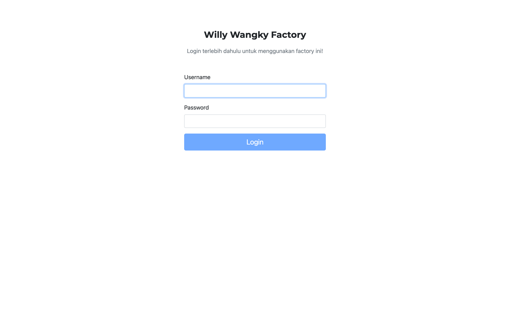
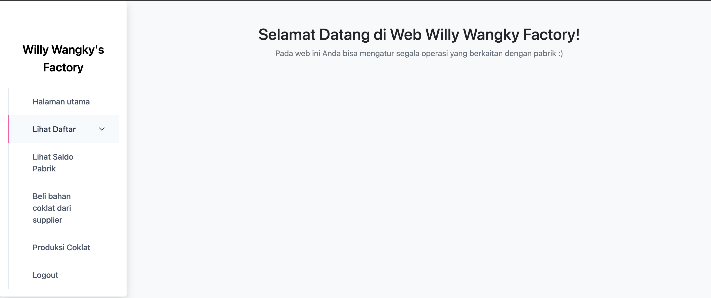
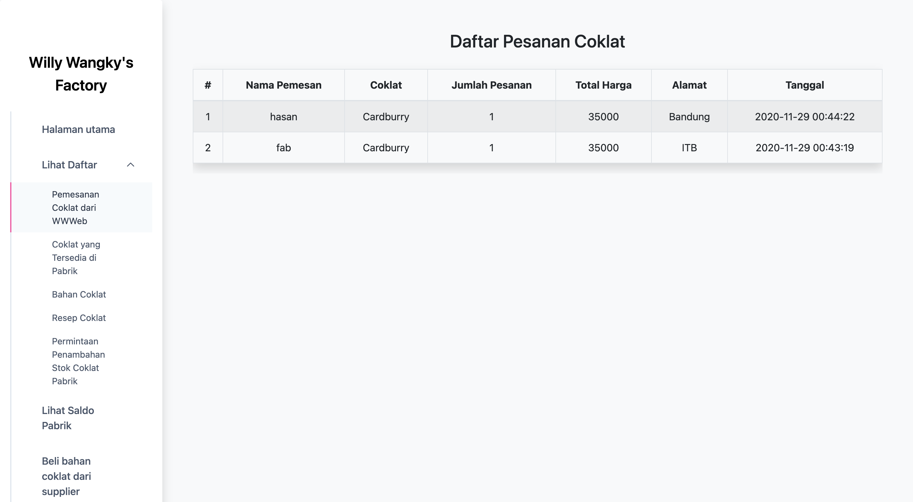
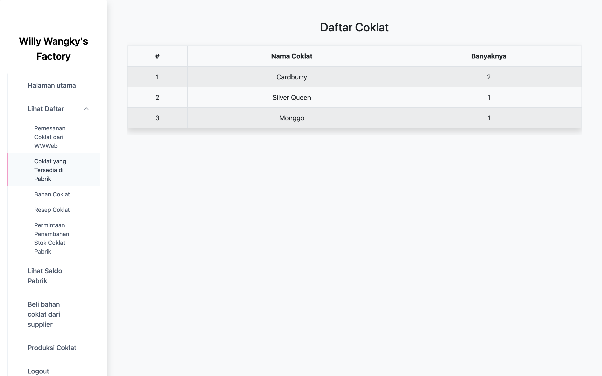
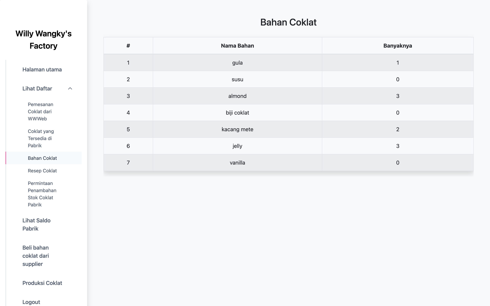
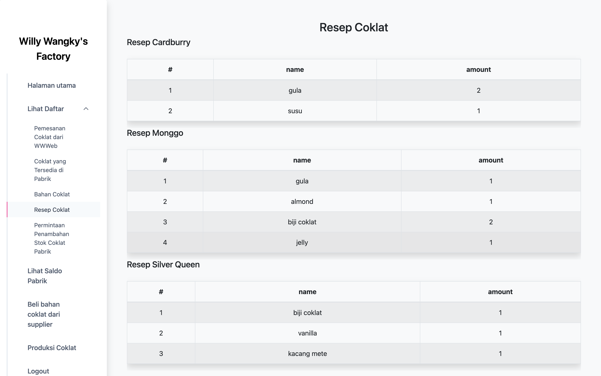
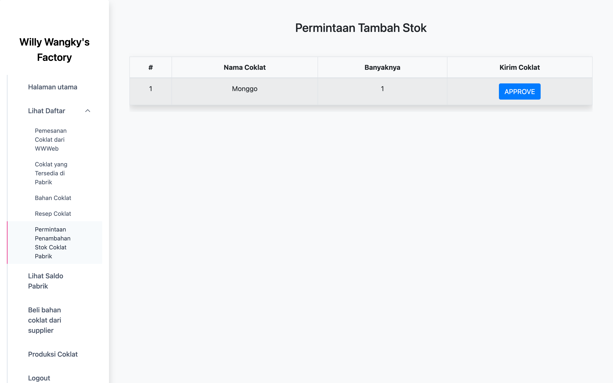
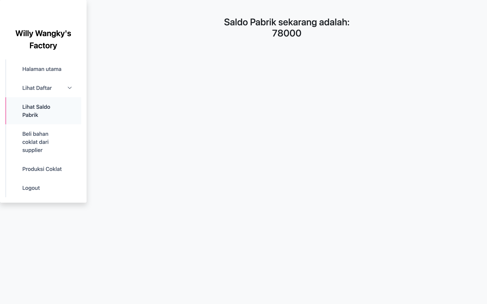
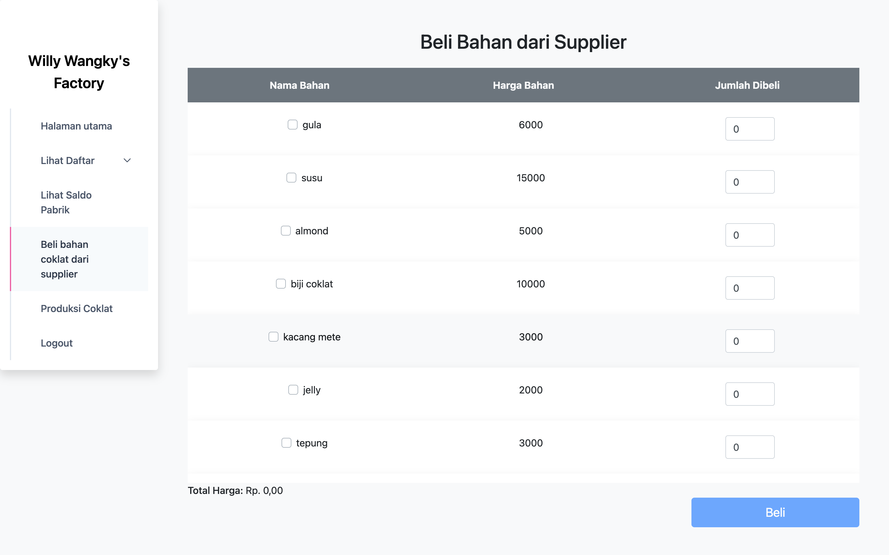
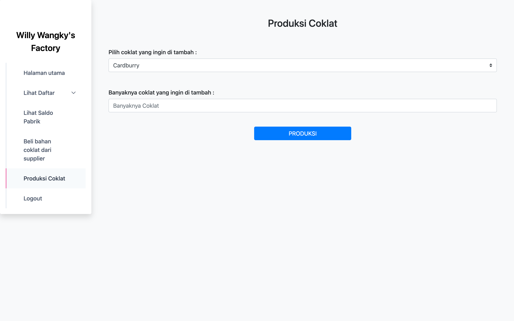

# Willy Wangky Factory
Web Interface - ReactJS

## Deskripsi
Aplikasi ini menyediakan antarmuka untuk mengatur segala operasi yang berkaitan dengan pabrik. Aplikasi ini dibangun dengan **ReactJs**.

## Tampilan Aplikasi
Berikut adalah tampilan aplikasi yang telah dibuat

## Halaman Login

## Halaman Utama

## Halaman Daftar Pemesanan Coklat dari WWWeb

## Halaman Daftar Coklat yang Tersedia di Pabrik

## Halaman Daftar Bahan Coklat

## Halaman Daftar Resep Coklat

## Halaman Daftar Permintaan Penambahan Stok Coklat Pabrik

## Halaman Lihat Saldo Pabrik

## Halaman Beli Bahan Coklat dari Supplier

## Halaman Produksi Coklat

## Author
13518012 | Muhammad Hasan \
13518019 | Muhammad Zunan Alfikri \
13518022 | Fabian Zhafransyah